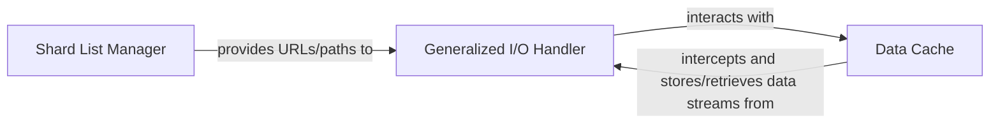

## Details

The Data Ingestion Layer in `webdataset` is a critical subsystem responsible for efficiently accessing raw data shards from diverse sources. It acts as the initial gateway for data entering the processing pipeline, abstracting away the complexities of data location and access.

### Shard List Manager

This component is responsible for generating, expanding, and managing the list of data shard URLs or paths. It handles various input formats, including glob patterns and brace expansion, to produce a concrete list of data sources. It also provides mechanisms for distributing these shard lists across multiple workers or nodes, which is essential for parallel and distributed data loading in deep learning.

**Related Classes/Methods**:

- <a href="https://github.com/webdataset/webdataset/blob/main/src/webdataset/shardlists.py" target="_blank" rel="noopener noreferrer">`webdataset.shardlists`</a>

### Generalized I/O Handler

This component provides a unified and abstracted interface for opening data streams from various sources, including local files, remote HTTP/HTTPS URLs, and potentially other cloud storage protocols. It encapsulates the logic for handling different I/O backends, allowing the rest of the data pipeline to interact with data sources uniformly, regardless of their origin.

**Related Classes/Methods**:

- <a href="https://github.com/webdataset/webdataset/blob/main/src/webdataset/gopen.py#L523-L590" target="_blank" rel="noopener noreferrer">`webdataset.gopen` (523:590)</a>

### Data Cache

This component implements caching mechanisms, specifically an LRU (Least Recently Used) file cache, to store frequently accessed data shards locally. By intercepting I/O requests and serving data from the cache when available, it significantly reduces redundant network or disk I/O operations, thereby improving data loading performance, especially in scenarios with repeated data access or distributed training.

**Related Classes/Methods**:

- <a href="https://github.com/webdataset/webdataset/blob/main/src/webdataset/cache.py" target="_blank" rel="noopener noreferrer">`webdataset.cache`</a>

### [FAQ](https://github.com/CodeBoarding/GeneratedOnBoardings/tree/main?tab=readme-ov-file#faq)