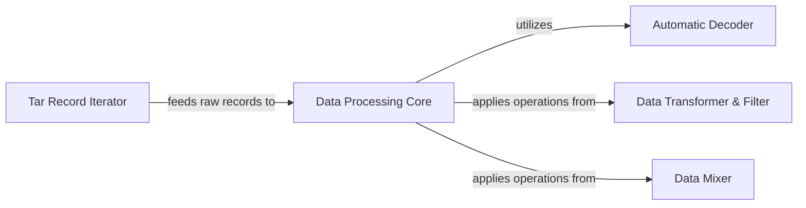

## Details

One paragraph explaining the functionality which is represented by this graph. What the main flow is and what is its purpose.

### Tar Record Iterator

This component is responsible for the initial extraction of individual data samples (records) from raw TAR archives. It acts as the first stage in the data processing pipeline, providing a stream of raw byte-level data entries.

**Related Classes/Methods**:

- <a href="https://github.com/webdataset/webdataset/blob/main/src/webdataset/tariterators.py#L1-L1" target="_blank" rel="noopener noreferrer">`webdataset/tariterators.py` (1:1)</a>

### Automatic Decoder

This component intelligently decodes raw byte streams into usable Python data types, such as images (Pillow, PyTorch tensors), audio, text, or other structured data. It handles various encoding formats automatically.

**Related Classes/Methods**:

- <a href="https://github.com/webdataset/webdataset/blob/main/src/webdataset/autodecode.py#L1-L1" target="_blank" rel="noopener noreferrer">`webdataset/autodecode.py` (1:1)</a>

### Data Transformer & Filter

This component provides a collection of functions and classes for applying various transformations and filters to the decoded data samples. Transformations can include resizing, normalization, augmentation (e.g., random crops, flips), while filters can be used to remove corrupted or unwanted samples.

**Related Classes/Methods**:

- <a href="https://github.com/webdataset/webdataset/blob/main/src/webdataset/filters.py#L1-L1" target="_blank" rel="noopener noreferrer">`webdataset/filters.py` (1:1)</a>

### Data Mixer

This component offers functionalities for combining or mixing data samples, either from different sources or within the same stream. This can involve strategies like batch mixing, sample-level mixing (e.g., Mixup, CutMix), or creating composite samples.

**Related Classes/Methods**:

- <a href="https://github.com/webdataset/webdataset/blob/main/src/webdataset/mix.py#L1-L1" target="_blank" rel="noopener noreferrer">`webdataset/mix.py` (1:1)</a>

### Data Processing Core [[Expand]](./Data_Processing_Core.md)

This is the central orchestration component that defines and manages the sequence of data processing operations. It allows chaining various stages like `Tar Record Iterator`, `Automatic Decoder`, `Data Transformer & Filter`, and `Data Mixer` to form a complete data loading pipeline. It ensures efficient and correct data flow within the `webdataset` library.

**Related Classes/Methods**:

- <a href="https://github.com/webdataset/webdataset/blob/main/src/webdataset/pipeline.py#L1-L1" target="_blank" rel="noopener noreferrer">`webdataset/pipeline.py` (1:1)</a>

### [FAQ](https://github.com/CodeBoarding/GeneratedOnBoardings/tree/main?tab=readme-ov-file#faq)