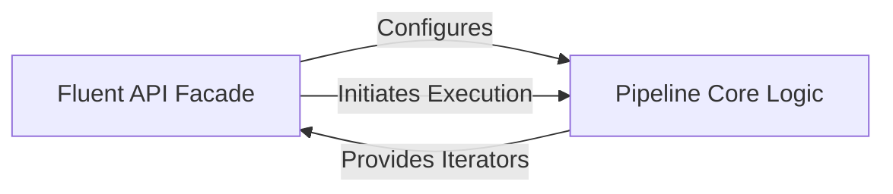

## Details

Component overview for `Pipeline Orchestration & API`, focusing on its structure, flow, and purpose within the `webdataset` project.

### Fluent API Facade

This component provides the high-level, chainable (fluent) interface that users interact with to declaratively define data loading and processing pipelines. It abstracts the complexities of underlying data iterators and pipeline stages, offering a user-friendly and intuitive way to construct `webdataset` pipelines. Classes like `WebDataset` and `WebLoader` serve as primary entry points, inheriting from `FluidInterface` to enable method chaining.

**Related Classes/Methods**:

- `FluidInterface`

- `FluidWrapper`

- `WebDataset`

- `WebLoader`

### Pipeline Core Logic

This component is responsible for the internal orchestration and execution of the data pipeline. It takes the sequence of operations defined by the Fluent API Facade and manages the flow of data through various processing stages. It ensures efficient iteration, transformation, and handling of samples, effectively implementing the pipeline execution based on the user's configuration.

**Related Classes/Methods**: _None_

### [FAQ](https://github.com/CodeBoarding/GeneratedOnBoardings/tree/main?tab=readme-ov-file#faq)