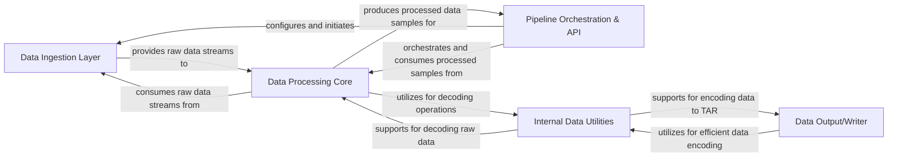

## Details

A high-level data flow overview of `webdataset`, focusing on its central modules and their interactions, aligned with typical Data Pipeline Library architecture.

### Data Ingestion Layer [[Expand]](./Data_Ingestion_Layer.md)

This component is responsible for identifying, locating, and opening data shards from various sources (local files, HTTP, cloud storage) and optionally caching them locally. It manages the initial access to raw data.

**Related Classes/Methods**:

- <a href="https://github.com/webdataset/webdataset/blob/main/src/webdataset/shardlists.py" target="_blank" rel="noopener noreferrer">`webdataset/shardlists.py`</a>

- <a href="https://github.com/webdataset/webdataset/blob/main/src/webdataset/gopen.py" target="_blank" rel="noopener noreferrer">`webdataset/gopen.py`</a>

- <a href="https://github.com/webdataset/webdataset/blob/main/src/webdataset/cache.py" target="_blank" rel="noopener noreferrer">`webdataset/cache.py`</a>

### Data Processing Core [[Expand]](./Data_Processing_Core.md)

The heart of the data pipeline, this component handles the extraction of individual samples from raw data streams (e.g., TAR archives), decodes raw byte streams into usable Python data types (images, tensors, text), and applies various transformations, augmentations, and mixing strategies to the data samples.

**Related Classes/Methods**:

- <a href="https://github.com/webdataset/webdataset/blob/main/src/webdataset/tariterators.py" target="_blank" rel="noopener noreferrer">`webdataset/tariterators.py`</a>

- <a href="https://github.com/webdataset/webdataset/blob/main/src/webdataset/autodecode.py" target="_blank" rel="noopener noreferrer">`webdataset/autodecode.py`</a>

- <a href="https://github.com/webdataset/webdataset/blob/main/src/webdataset/filters.py" target="_blank" rel="noopener noreferrer">`webdataset/filters.py`</a>

- <a href="https://github.com/webdataset/webdataset/blob/main/src/webdataset/mix.py" target="_blank" rel="noopener noreferrer">`webdataset/mix.py`</a>

### Pipeline Orchestration & API [[Expand]](./Pipeline_Orchestration_API.md)

This central component provides the framework for chaining together different data processing stages into a coherent, iterable data pipeline. It exposes a user-friendly, chainable API (Fluent API) for defining and configuring the pipeline, abstracting away the direct manipulation of underlying components.

**Related Classes/Methods**:

- <a href="https://github.com/webdataset/webdataset/blob/main/src/webdataset/pipeline.py" target="_blank" rel="noopener noreferrer">`webdataset/pipeline.py`</a>

- <a href="https://github.com/webdataset/webdataset/blob/main/src/webdataset/compat.py" target="_blank" rel="noopener noreferrer">`webdataset/compat.py`</a>

### Data Output/Writer [[Expand]](./Data_Output_Writer.md)

This component manages the serialization of processed data samples back into the WebDataset (TAR) format. It handles encoding various data types and the creation of new TAR archives, potentially splitting them into multiple shards.

**Related Classes/Methods**:

- <a href="https://github.com/webdataset/webdataset/blob/main/src/webdataset/writer.py" target="_blank" rel="noopener noreferrer">`webdataset/writer.py`</a>

### Internal Data Utilities

A foundational component providing low-level utilities for efficient binary encoding and decoding of data structures, particularly for numerical arrays and lists. It supports internal serialization and deserialization processes within the library.

**Related Classes/Methods**:

- <a href="https://github.com/webdataset/webdataset/blob/main/src/webdataset/tenbin.py" target="_blank" rel="noopener noreferrer">`webdataset/tenbin.py`</a>

### [FAQ](https://github.com/CodeBoarding/GeneratedOnBoardings/tree/main?tab=readme-ov-file#faq)